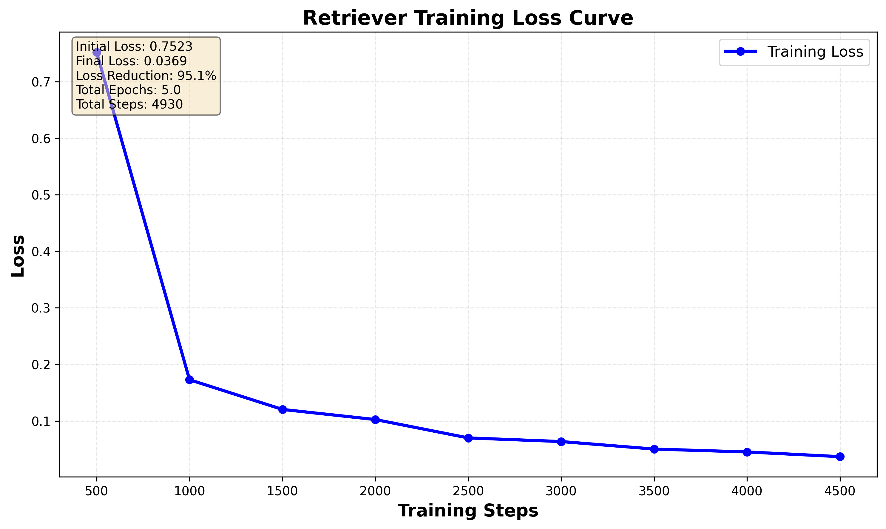
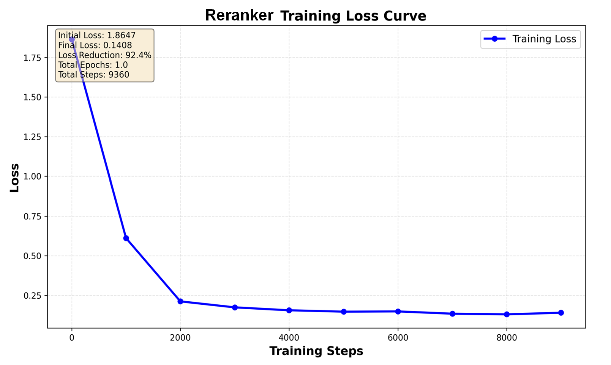

# RAG (Retrieval-Augmented Generation)

本專案主題為 **RAG (Retrieval-Augmented Generation)** 模型訓練。目標是透過微調 **Retriever (檢索器)** 與 **Reranker (重排序器)**，並結合 **Prompt Engineering (提示工程)**，來提升大型語言模型 (LLM) 在問答任務上的精確度與完整性。

## 目錄
- [專案簡介](#專案簡介)
- [方法論](#方法論)
- [實驗設計](#實驗設計)
- [實驗結果](#實驗結果)
- [環境設定](#環境設定)
- [資料準備](#資料準備)
- [模型訓練](#模型訓練)
  - [訓練 Retriever](#訓練-retriever)
  - [訓練 Reranker](#訓練-reranker)
- [執行推論](#執行推論)
- [完整檔案結構](#完整檔案結構)
- [常見問題排解](#常見問題排解)
- [聯絡資訊](#聯絡資訊)

---

## 專案簡介

在開放領域問答 (Open-domain QA) 中，模型需要從海量知識庫中找到準確資訊並回答問題。本專案實作了一個完整的 RAG Pipeline：
1.  **Retriever**: 使用雙編碼器 (Bi-Encoder) 從語料庫中快速檢索出候選文檔。
2.  **Reranker**: 使用交叉編碼器 (Cross-Encoder) 對候選文檔進行精細排序，篩選出最相關的內容。
3.  **Generator**: 利用 LLM 閱讀篩選後的文檔，生成最終答案。

透過此流程，我們解決了 LLM 幻覺 (Hallucination) 與知識過時的問題。

## 方法論

### 1. Retriever (檢索器)
- **模型架構**: Bi-Encoder (雙編碼器)。
- **基底模型**: `intfloat/multilingual-e5-small`。
- **運作原理**: 將 Query 與 Passage 分別編碼為向量，計算 Cosine Similarity 進行檢索。
- **訓練策略**: 
  - **Loss Function**: Multiple Negatives Ranking Loss (MNRL)。
  - **負樣本採樣**: 結合 In-batch negatives (同批次其他樣本) 與 Random negatives (隨機採樣)。

### 2. Reranker (重排序器)
- **模型架構**: Cross-Encoder (交叉編碼器)。
- **基底模型**: `cross-encoder/ms-marco-MiniLM-L-12-v2`。
- **運作原理**: 將 Query 與 Passage 拼接輸入模型，直接輸出相關性分數 (0~1)。
- **訓練策略**:
  - **Loss Function**: Binary Cross-Entropy Loss (BCE)。
  - **負樣本採樣**: 
    - **Hard Negatives**: 使用 BM25 檢索但標註為不相關的文檔 (困難負樣本)。
    - **Random Negatives**: 隨機採樣補充。

### 3. Prompt Engineering (提示工程)
為了讓 LLM 準確回答，我們設計了特定的 Prompt 模板：
- **System Prompt**: 限制模型僅能根據提供的 Context 回答，若無答案則輸出 "CANNOTANSWER"。
- **User Prompt**: 結構化呈現檢索到的 Contexts 與使用者的 Query。
- **Answer Parsing**: 針對 Chain-of-Thought (CoT) 輸出進行後處理，精確提取答案。

## 實驗設計

### 使用模型
- **LLM (Generator)**: `Qwen/Qwen3-1.7B`
  - 本實驗選用此模型作為生成器，負責閱讀檢索到的文檔並生成最終答案。

### 資料集
- **Corpus (`corpus.txt`)**: 包含所有候選 Passage 的知識庫。
- **Train Set (`train.txt`)**: 訓練用 Queries。
- **Qrels (`qrels.txt`)**: Query 與 Passage 的相關性標註 (Ground Truth)。
- **Test Set (`test_open.txt`)**: 測試用 Queries，用於評估最終效能。

### 評估指標
- **Recall@K**: 正確答案出現在前 K 筆檢索結果的比例 (評估 Retriever)。
- **MRR@K (Mean Reciprocal Rank)**: 正確答案排名倒數的平均值 (評估 Reranker 排序品質)。

## 實驗結果

在測試集 (`test_open.txt`) 上的評估結果如下：

| Metric | Value | 說明 |
|--------|-------|------|
| **Recall@10** | **0.8734** | Retriever 成功在前 10 筆找回相關文檔的比例高達 87%。 |
| **MRR@10** | **0.7632** | 經過 Reranker 重排序後，相關文檔的平均排名顯著提升。 |
| **Bi-Encoder CosSim** | 0.3855 | Retriever 向量空間的平均相似度。 |

> **觀察**: 引入 Reranker 後，雖然計算成本增加，但 MRR 指標顯著優於僅使用 Retriever，證明 Two-stage retrieval 的必要性。

---

## 環境設定

### 1. 系統需求
- Python 3.12
- CUDA-compatible GPU
- conda 或 venv 虛擬環境管理工具

### 2. 安裝依賴套件

```bash
# 創建虛擬環境
python -m venv .venv
.venv\Scripts\activate

# 安裝必要套件
pip install -r requirements.txt
```

### 3. 設定 Hugging Face Token

在專案根目錄創建 `.env` 檔案：

```bash
# .env
hf_token=你的_huggingface_token
```

Token 取得方式：https://huggingface.co/settings/tokens

---

## 資料準備

### 1. 下載並放置資料

將資料檔案放置於 `./data/` 目錄：

```
./data/
├── corpus.txt          # Passage 語料庫（JSONL 格式）
├── train.txt           # 訓練用 queries（JSONL 格式）
├── qrels.txt           # Query-passage 相關性標籤（JSON 格式）
└── test_open.txt       # 測試用 queries（JSONL 格式）
```

### 2. 建立向量資料庫（用於 Retriever）

```bash
python save_embeddings.py \
    --retriever_model_path ./models/retriever \
    --build_db
```

此步驟會產生：
- `./vector_database/passage_index.faiss` - FAISS 索引
- `./vector_database/passage_store.db` - SQLite 資料庫

---

## 模型訓練

### 訓練 Retriever

Retriever 使用雙編碼器（bi-encoder）架構，採用 E5 embeddings 和 Multiple Negatives Ranking Loss（MNRL）。

#### 基本訓練指令

```bash
wandb disabled (如果要關閉 wandb 可以先執行這個指令)
python train_retriever.py \
    --model_name intfloat/multilingual-e5-small \
    --train_path ./data/train.txt \
    --corpus_path ./data/corpus.txt \
    --qrels_path ./data/qrels.txt \
    --output_path ./models/retriever \
    --train_batch_size 32 \
    --max_seq_length 512 \
    --evaluation_steps 0 \
    --epochs 5 \
    --lr 2e-5 \
    --warmup_steps 1000 \
    --num_negatives 4 \
    --log_steps 50
```

#### 主要參數說明

| 參數 | 預設值 | 說明 |
|------|-------|------|
| `--model_name` | `intfloat/multilingual-e5-small` | 基礎 retriever 模型 |
| `--epochs` | 5 | 訓練輪數 |
| `--train_batch_size` | 32 | 訓練批次大小，可依照硬體資源調整 |
| `--evaluation_steps` | 0 | 每n步進行一次評估，0為不評估 |
| `--lr` | 2e-5 | 學習率 |
| `--warmup_steps` | 1000 | Warmup 步數 |
| `--num_negatives` | 4 | 每個 query 的隨機負樣本數 |
| `--log_steps` | 50 | 每50步記錄一次loss |

#### 訓練策略說明

- **Loss Function**: Multiple Negatives Ranking Loss (MNRL)
  - **公式**:
  
    $$ 
    \mathcal{L} = - \log \frac{\exp(\text{sim}(q_i, p_i^+) / \tau)}{\sum_j \exp(\text{sim}(q_i, p_j) / \tau)}
    $$

    其中 $sim(q, p)$ 為 query 與 passage 的餘弦相似度，$\tau$ 為溫度參數。

  - **說明**: 對於每一個 query $q_i$，只有其對應的正樣本 $p_i^+$ 被視為正例，而同一個 batch 中的其他所有 passages $p_j (j \neq i)$ 都被視為負樣本 (In-batch negatives)。這使得模型能在大 batch size 下高效學習區分相關與不相關文檔。

- **訓練曲線**:
  
  > 圖表顯示隨著訓練步數增加，Loss 呈現下降趨勢，表示模型逐漸收斂。

#### 訓練資料構建

1. **Anchor (Query)**
   - **來源**: `train.txt` 中的 "rewrite" 欄位
   - **格式**: `"query: " + query text` (E5 模型要求的前綴)
   - **數量**: 總共 31,526 條 queries

2. **Positive Sampling (正樣本)**
   - **方法**: 從 `qrels.txt` 中擷取標籤為 1 的文字
   - **格式**: `"passage: " + passage text`
   - **驗證**: 確保所有 PID 都存在於 Corpus 中
   - **統計**: 每個 query 包含 1 個 positive passage

3. **Negative Sampling (負樣本)**
   - **策略**: 從語料庫中隨機抽取
   - **原因**: 避免 `evidences` 欄位中可能存在的標註錯誤
   - **數量**: 每個 query 包含 4 個顯式負樣本
   - **In-batch negatives**: 31 個 (batch_size 32 - 1)
   - **總負樣本**: 每個 query 約 35 個

**預期訓練時間**: 單 GPU 訓練 3 epochs 約需 2-3 小時

**輸出檔案：**
```
./models/retriever/
├── config.json
├── model.safetensors
├── tokenizer_config.json
└── ...
```

---

### 訓練 Reranker

Reranker 使用交叉編碼器（cross-encoder）架構，採用 Binary Cross-Entropy Loss。

#### 基本訓練指令

```bash
python train_reranker.py \
    --model_name cross-encoder/ms-marco-MiniLM-L-12-v2 \
    --corpus_path ./data/corpus.txt \
    --train_path ./data/train.txt \
    --qrels_path ./data/qrels.txt \
    --output_path ./models/reranker \
    --num_epochs 1 \
    --batch_size 16 \
    --learning_rate 5e-6 \
    --warmup_ratio 0.1 \
    --num_neg_per_query 4 \
    --eval_steps 3000 \
    --save_steps 3000 \
    --logging_steps 1000
```

#### 主要參數說明

| 參數 | 預設值 | 說明 |
|------|-------|------|
| `--model_name` | `cross-encoder/ms-marco-MiniLM-L-12-v2` | 基礎 reranker 模型 |
| `--num_epochs` | 1 | 訓練輪數 |
| `--batch_size` | 16 | 訓練批次大小 |
| `--learning_rate` | 5e-6 | 學習率 |
| `--warmup_ratio` | 0.1 | Warmup 比例 |
| `--num_neg_per_query` | 4 | 每個 query 的負樣本數 |
| `--eval_split` | 0.05 | 評估資料集比例 |
| `--eval_steps` | 3000 | 每3000步評估一次 |
| `--save_steps` | 3000 | 每3000步記錄一次checkpoint |
| `--logging_steps` | 1000 | 每1000步記錄一次loss |

#### 訓練策略說明

- **Loss Function**: Binary Cross-Entropy Loss (BCE)
  - **公式**:

    $$
    \mathcal{L} = -\frac{1}{N} \sum_{i=1}^{N} [y_i \log(\hat{y}_i) + (1-y_i) \log(1-\hat{y}_i)]
    $$

    其中 $y_i$ 為真實標籤 (1 為相關，0 為不相關)，$\hat{y}_i$ 為模型預測的相關機率。

  - **說明**: 將重排序任務視為二元分類問題。模型接收 (query, passage) 對，輸出該 passage 是否相關的機率 (0~1)。透過最小化預測機率與真實標籤之間的差異來優化模型。

- **訓練曲線**:
  
  > 圖表顯示 Loss 隨著訓練進行而下降，模型學習判斷 query 與 passage 的相關性。

#### 訓練資料構建

1. **Anchor (Query)**
   - **來源**: `train.txt` 中的 "rewrite" 欄位
   - **說明**: 每個 query 對應一個問題

2. **Positive Sampling (正樣本)**
   - **來源**: 透過 `qrels.txt` 取得每個 query 的正確 passage ID
   - **方法**: 從 `corpus.txt` 中提取對應的 passage 文本
   - **配對**: 每個 query 配對 1 個 positive passage，標籤為 1

3. **Negative Sampling (負樣本)**
   - **策略 1**: 優先使用 `train.txt` 中 `evidences` 欄位內標籤為 0 的 passages (BM25 hard negatives)
   - **策略 2**: 若 hard negatives 不足，從 corpus 隨機採樣補充
   - **配對**: 每個 query 配對 N 個 negative passages，標籤為 0
   - **設定**: 實驗中測試了每個 batch 4 個 negative

4. **最終資料格式**
   - **Columns**: `['query', 'passage', 'label']`
   - **query**: 問題文本
   - **passage**: Passage 文本
   - **label**: 1 (positive) 或 0 (negative)

**實驗觀察與模型選擇**:
在本次實驗中，我們嘗試了對 Reranker 進行微調。然而實驗結果顯示，由於 Base Model (`cross-encoder/ms-marco-MiniLM-L-12-v2`) 已經在大規模 MS MARCO 資料集上充分訓練，其泛化能力極強。在我們的資料集上進一步微調反而導致了**過擬合 (Overfitting)**，使得 MRR 分數不升反降。

因此，**我們最終決定直接採用預訓練的 Base Model 進行推論**，以獲得最佳效能。若使用者欲嘗試訓練，建議使用極低的學習率 (e.g., 5e-6) 並嚴格監控驗證集表現。

**預期訓練時間**: 1 epoch 約需 30-60 分鐘

**輸出檔案：**
```
./models/reranker/
├── checkpoint-3000/            # 第一個檢查點
│   ├── config.json
│   ├── model.safetensors
│   └── trainer_state.json     # 訓練狀態與指標
├── checkpoint-6000/           # 第二個檢查點
├── final/                     # 最終模型
│   ├── config.json
│   └── model.safetensors
└── ...
```

---

### 繪製訓練 Loss 曲線
```bash
python plot_training_curves.py \
    --trainer_state_path ./models/reranker/checkpoint-18720/trainer_state.json \
    --output_dir ./report_figures_reranker1 \
    --output_name training_curves \
    --dpi 300 \
    --figsize 14,10
```
需要有 `trainer_state.json` 才能夠繪製圖表

---

## 執行推論

### 完整 Pipeline 推論

```bash
python inference_batch.py \
    --retriever_model_path ./models/retriever \
    --reranker_model_path ./models/reranker \
    --test_data_path ./data/test_open.txt
```

**預期輸出：**
```
Queries evaluated: 3342
Recall@10: 0.8734
MRR@10 (after rerank): 0.7632
Bi-Encoder CosSim: 0.3855
```

---

## 完整檔案結構

```
.
├── data/
│   ├── corpus.txt                 # Passage 語料庫
│   ├── train.txt                  # 訓練 queries
│   ├── qrels.txt                  # 相關性標籤
│   └── test_open.txt              # 測試 queries
├── models/
│   ├── retriever/                 # 訓練好的 retriever
│   └── reranker/                  # 訓練好的 reranker
├── vector_database/
│   ├── passage_index.faiss        # FAISS 索引
│   └── passage_store.db           # SQLite 資料庫
├── save_embeddings.py             # 建立向量資料庫
├── inference_batch.py             # 執行推論
├── utils.py                       # prompt指令函式
├── train_retriever.py             # 訓練 retriever
├── train_reranker.py              # 訓練 reranker
├── download.sh                    # 下載模型權重
├── .env                           # 環境變數
├── README.md                      # 本說明文件
└── report.pdf                     # 報告文件
```

---

## 常見問題排解

### 1. 記憶體不足（Out of Memory）

**解決方案**: 減少 batch size
```bash
# Retriever
python train_retriever.py --train_batch_size 16

# Reranker
python train_reranker.py --batch_size 8
```

### 2. Reranker 訓練後效能下降

**問題**: 訓練後 MRR 反而降低

**解決方案**: 使用更低的學習率或直接使用 base model
```bash
# 方案 1: 降低學習率
python train_reranker.py --learning_rate 5e-6

# 方案 2: 直接使用 base model（不訓練，本次作業直接採用 base model）
python inference_batch.py \
    --reranker_model_path cross-encoder/ms-marco-MiniLM-L-12-v2
```

---

## 參考資料

1. **Sentence Transformers Documentation**: https://www.sbert.net/
2. **MS MARCO Dataset**: https://microsoft.github.io/msmarco/
3. **E5 Text Embeddings**: https://huggingface.co/intfloat/multilingual-e5-small
4. **Cross-Encoder for Re-Ranking**: https://www.sbert.net/examples/applications/cross-encoder/README.html
5. **MultipleNegativesRankingLoss**: https://www.sbert.net/docs/package_reference/losses.html#multiplenegativesrankingloss

---

## License

本專案為 NTU ADL 2025 課程作業,僅供教育用途。

---

## 聯絡資訊

如有問題或建議，請聯絡：alvinlo062@gmail.com

---

作者：Alvin Lo